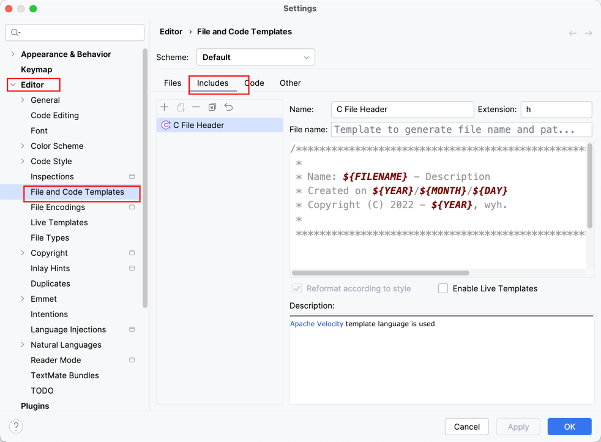

# 配置Fedora Server

### 1. 下载安装developing tools

```shell
yum install gcc -y
yum install gdb -y
yum install make -y
yum install cmake -y
yum install python -y
yum install patch -y
yum install diffstat -y
```

### 2. 配置VCS

1. **install git**

```shell
yum install git -y
```

2. **config git**

设置用户名和邮箱

```shell
git config --global user.name "wuyhyh"
git config --global user.email wuyhyh@gmail.com
```

查看设置

```shell
git config --list | more
```

3. **生成ssh密钥并配置到github**

```shell
ssh-keygen
```

### 3. 安装zsh并美化

安装zsh

```shell
dnf install zsh
```

修改默认shell为zsh

```shell
chsh -s $(which zsh)
```

安装oh-my-zsh

```shell
sh -c "$(curl -fsSL https://raw.github.com/ohmyzsh/ohmyzsh/master/tools/install.sh)"
```

### 4. 修改主机名

在 Fedora Server 上修改主机名可以通过以下几种方法完成：

#### 使用 `hostnamectl` 命令

这是最推荐的方法，因为它简单且适用于现代的 Linux 发行版。

1. 打开终端。
2. 以 root 用户或使用 sudo 权限运行以下命令：

```bash
sudo hostnamectl set-hostname new-hostname
```

将 `new-hostname` 替换为你想要的新主机名。

3. 验证主机名是否已更改：

```bash
hostnamectl status
```

#### 临时更改主机名

如果你只想临时更改主机名（在下次重启后会恢复原样），可以使用 `hostname` 命令：

```bash
sudo hostname new-hostname
```

这将立即更改主机名，但不会在重启后保留。

### 5. 修改时区

在 Fedora Server 上设置时区可以通过以下步骤完成：

1. **查看当前时区**：

    ```bash
   timedatectl
   ```

2. **列出所有可用时区**：

   ```bash
   timedatectl list-timezones
   ```

   这会列出所有可用时区，你可以通过滚动或搜索找到你需要的时区。

3. **设置新的时区**：

   假设你想要将时区设置为 `Asia/Shanghai`，你可以使用以下命令：

   ```bash
   sudo timedatectl set-timezone Asia/Shanghai
   ```

4. **确认时区更改**：

   再次使用以下命令查看当前时区，以确认更改已生效：

   ```bash
   timedatectl
   ```

这就完成了在 Fedora Server 上设置时区的步骤。如果你需要设置其他的时区，只需在第三步中替换为相应的时区名称即可。

### CLion设置

**1. 设置文件头部注释**



头部注释模板：

```shell
/******************************************************************************
 *
 * Name: ${FILENAME} - Description
 * Created on ${YEAR}/${MONTH}/${DAY}
 * Copyright (C) 2022 - ${YEAR}, wyh.
 *
 *****************************************************************************/
```
