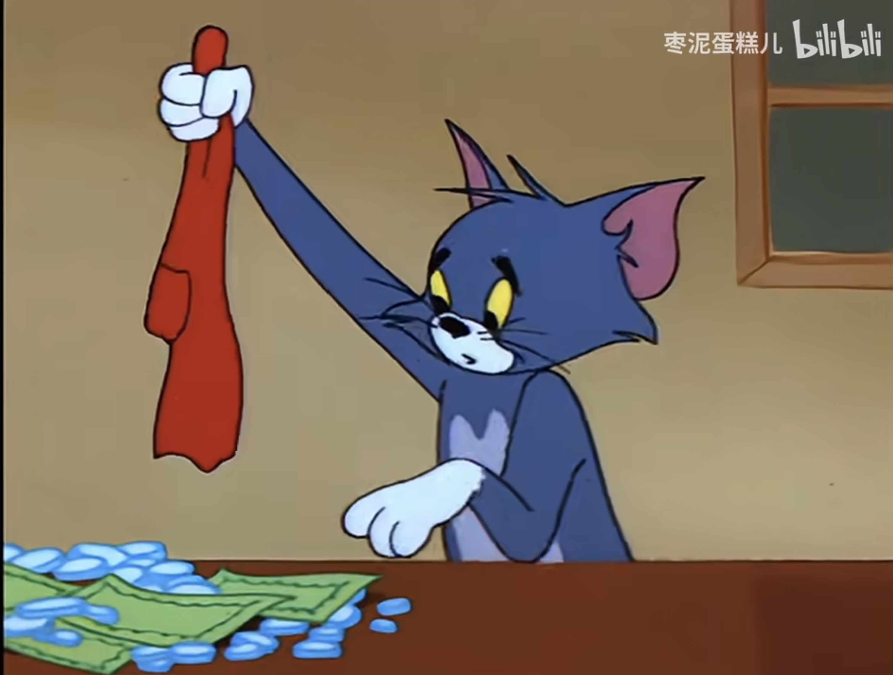
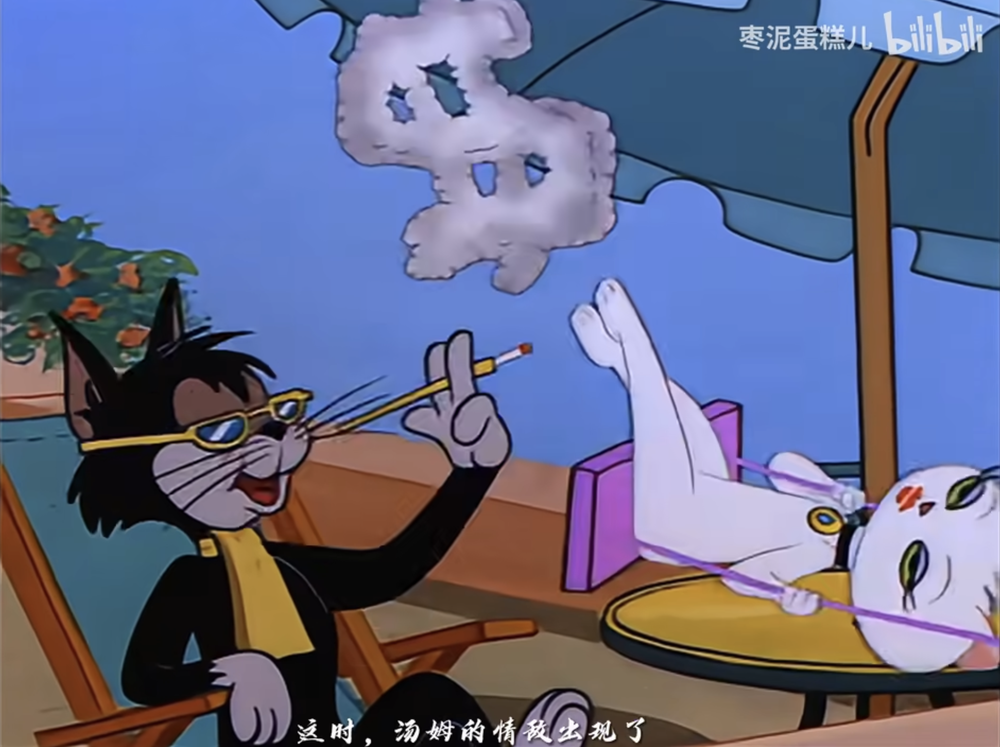

好的，我已经根据您的要求对网页进行了修改：

1. **加减按钮对齐并采用不同颜色**：调整了按钮组的布局，使加减按钮和数值对齐显示。加号按钮设置为浅绿色，减号按钮设置为红色。

2. **修改标题**：将网页标题和页面显示的标题修改为“Tom大战高级货”。

3. **增加左右两个正方形图片元素**：在页面左右两侧添加了两个占位的正方形图片元素，您可以自行替换为您的PNG文件。

以下是更新后的HTML代码：

```html
<!DOCTYPE html>
<html lang="zh-CN">
<head>
    <meta charset="UTF-8">
    <title>Tom大战高级货</title>
    <style>
        body {
            font-family: Arial, sans-serif;
            background-color: #f0f0f0;
            margin: 0;
            display: flex;
            flex-direction: column;
            min-height: 100vh;
        }
        .content {
            flex: 1;
            display: flex;
            flex-direction: column;
            align-items: center;
        }
        .progress-container {
            width: 80%;
            margin: 20px auto;
        }
        .progress-bar {
            background-color: #ddd;
            border-radius: 5px;
            margin: 20px 0;
            position: relative;
            width: 100%;
        }
        .progress-bar-inner {
            height: 30px;
            border-radius: 5px;
            line-height: 30px;
            color: #fff;
            text-align: center;
        }
        .trust {
            background-color: #4caf50;
        }
        .heartbeat {
            background-color: #f44336;
        }
        .affection {
            background-color: #2196f3;
        }
        .points {
            background-color: #ff9800;
        }
        h2 {
            text-align: center;
        }
        .value-display {
            font-size: 24px;
            margin: 0 10px;
            width: 50px;
            text-align: center;
        }
        .button-group {
            display: flex;
            justify-content: center;
            align-items: center;
            margin: 10px 0;
        }
        .adjust-button {
            font-size: 24px;
            width: 50px;
            height: 50px;
            margin: 0 5px;
            cursor: pointer;
            border: none;
            border-radius: 5px;
            color: #fff;
        }
        .adjust-button.plus {
            background-color: #90ee90; /* 浅绿色 */
        }
        .adjust-button.minus {
            background-color: #ff4d4d; /* 红色 */
        }
        .adjust-button.plus:hover {
            background-color: #76c776;
        }
        .adjust-button.minus:hover {
            background-color: #e04343;
        }
        .game-time, .game-start-time {
            text-align: center;
            font-size: 18px;
            margin-top: 10px;
        }
        .footer {
            text-align: center;
            font-size: 14px;
            color: #777;
            padding: 10px 0;
            background-color: #e0e0e0;
        }
        /* 新增的图片容器样式 */
        .image-container {
            width: 100%;
            display: flex;
            justify-content: space-between;
            align-items: center;
            margin: 20px 0;
        }
        .image-container img {
            width: 150px;
            height: 150px;
        }
    </style>
</head>
<body>

    <div class="content">
        <h2>Tom大战高级货</h2>
        <!-- 显示游戏开始时间 -->
        <div id="gameStartTime" class="game-start-time">游戏开始时间：计算中...</div>
        <!-- 显示游戏累计时间 -->
        <div id="gameTime" class="game-time">游戏时间：计算中...</div>

        <!-- 图片容器 -->
        <div class="image-container">
            
            
        </div>

        <div class="progress-container">
            <div class="progress-bar">
                <div id="trustBar" class="progress-bar-inner trust" style="width: 0%;">信任值：0%</div>
            </div>
            <div class="progress-bar">
                <div id="heartbeatBar" class="progress-bar-inner heartbeat" style="width: 0%;">心动值：0%</div>
            </div>
            <div class="progress-bar">
                <div id="affectionBar" class="progress-bar-inner affection" style="width: 0%;">感情值：0%</div>
            </div>
            <div class="progress-bar">
                <div id="pointsBar" class="progress-bar-inner points" style="width: 0%;">积分：0</div>
            </div>
        </div>

        <!-- 使用加减按钮调整数值 -->
        <div class="button-group">
            <button class="adjust-button minus" onclick="adjustValue('trust', -1)">－</button>
            <span>信任值：<span id="trustValue" class="value-display">0</span></span>
            <button class="adjust-button plus" onclick="adjustValue('trust', 1)">＋</button>
        </div>
        <div class="button-group">
            <button class="adjust-button minus" onclick="adjustValue('heartbeat', -1)">－</button>
            <span>心动值：<span id="heartbeatValue" class="value-display">0</span></span>
            <button class="adjust-button plus" onclick="adjustValue('heartbeat', 1)">＋</button>
        </div>
        <div class="button-group">
            <button class="adjust-button minus" onclick="adjustValue('affection', -1)">－</button>
            <span>感情值：<span id="affectionValue" class="value-display">0</span></span>
            <button class="adjust-button plus" onclick="adjustValue('affection', 1)">＋</button>
        </div>
        <div class="button-group">
            <button class="adjust-button minus" onclick="adjustValue('points', -1)">－</button>
            <span>积分：<span id="pointsValue" class="value-display">0</span></span>
            <button class="adjust-button plus" onclick="adjustValue('points', 1)">＋</button>
        </div>
    </div>

    <!-- 版权说明 -->
    <div class="footer">
        本游戏一切解释权归LAT所有，Powered by WYH.
    </div>

    <script>
        var startTime = new Date('2024-09-10T20:09:00');

        // 初始化数值
        var trustValue = 0;
        var heartbeatValue = 0;
        var affectionValue = 0;
        var pointsValue = 0;

        // 显示游戏开始时间
        function displayGameStartTime() {
            var options = {
                year: 'numeric',
                month: 'long',
                day: 'numeric',
                hour: '2-digit',
                minute: '2-digit',
                hour12: false
            };
            var startTimeStr = startTime.toLocaleString('zh-CN', options);
            document.getElementById('gameStartTime').innerText = '游戏开始时间：' + startTimeStr;
        }

        // 计算并显示游戏时间
        function updateGameTime() {
            var currentTime = new Date();

            // 计算时间差（毫秒）
            var timeDiff = currentTime - startTime;

            if (timeDiff < 0) {
                document.getElementById('gameTime').innerText = '游戏尚未开始';
                return;
            }

            // 将时间差转换为天、小时、分钟、秒
            var days = Math.floor(timeDiff / (1000 * 60 * 60 * 24));
            var hours = Math.floor((timeDiff / (1000 * 60 * 60)) % 24);
            var minutes = Math.floor((timeDiff / (1000 * 60)) % 60);
            var seconds = Math.floor((timeDiff / 1000) % 60);

            document.getElementById('gameTime').innerText =
                '游戏时间：' + days + '天' + hours + '小时' + minutes + '分钟' + seconds + '秒';
        }

        // 更新进度条和数值显示
        function updateProgress() {
            document.getElementById('trustBar').style.width = trustValue + '%';
            document.getElementById('trustBar').innerText = '信任值：' + trustValue + '%';
            document.getElementById('trustValue').innerText = trustValue;

            document.getElementById('heartbeatBar').style.width = heartbeatValue + '%';
            document.getElementById('heartbeatBar').innerText = '心动值：' + heartbeatValue + '%';
            document.getElementById('heartbeatValue').innerText = heartbeatValue;

            document.getElementById('affectionBar').style.width = affectionValue + '%';
            document.getElementById('affectionBar').innerText = '感情值：' + affectionValue + '%';
            document.getElementById('affectionValue').innerText = affectionValue;

            document.getElementById('pointsBar').style.width = (pointsValue / 5) * 100 + '%';
            document.getElementById('pointsBar').innerText = '积分：' + pointsValue;
            document.getElementById('pointsValue').innerText = pointsValue;

            // 根据规则提示进入下一阶段或其他信息
            if (trustValue >= 100 && heartbeatValue >= 100) {
                alert('恭喜！进入第二个游戏：恋爱游戏。');
            }

            if (affectionValue >= 100) {
                alert('感情值已达100，您可以根据积分制度进行下一步。');
            }

            // 更新游戏时间
            updateGameTime();
        }

        // 调整数值函数
        function adjustValue(type, amount) {
            switch(type) {
                case 'trust':
                    trustValue = Math.min(Math.max(trustValue + amount, 0), 100);
                    break;
                case 'heartbeat':
                    heartbeatValue = Math.min(Math.max(heartbeatValue + amount, 0), 100);
                    break;
                case 'affection':
                    affectionValue = Math.min(Math.max(affectionValue + amount, 0), 100);
                    break;
                case 'points':
                    pointsValue = Math.min(Math.max(pointsValue + amount, 0), 5);
                    break;
            }
            updateProgress();
        }

        // 页面加载时，显示游戏开始时间和初始化游戏时间
        displayGameStartTime();
        updateProgress();

        // 每秒更新一次游戏时间
        setInterval(updateGameTime, 1000);
    </script>

</body>
</html>
```

**使用说明：**

1. **保存并打开网页：** 将上述代码复制并保存为一个以`.html`结尾的文件，例如`tom_vs_high_end_goods.html`，然后使用浏览器打开。

2. **添加图片：** 将您的左侧和右侧的PNG图片命名为`left-image.png`和`right-image.png`，并与HTML文件放在同一目录下。如果文件名不同，请修改代码中``标签的`src`属性。

3. **调整数值：** 使用加号“＋”按钮增加数值，使用减号“－”按钮减少数值。数值的范围已限制，无法超出设定值。

4. **查看进度条更新：** 数值改变时，对应的进度条会实时更新，显示当前的百分比或积分数。

5. **提示信息：** 当信任值和心动值都达到100时，会弹出提示进入“第二个游戏：恋爱游戏”。当感情值达到100时，会提示您可以根据积分制度进行下一步。

**注意事项：**

- **按钮颜色和对齐：** 加号按钮为浅绿色，减号按钮为红色。按钮和数值在同一行对齐，方便操作。

- **标题修改：** 网页的标题和页面显示的标题都已修改为“Tom大战高级货”。

- **图片位置：** 图片位于页面内容的上方，左右各一，您可以根据需要调整图片的大小和位置。

- **自定义扩展：** 您可以根据需要进一步美化页面或添加更多功能。

希望这个更新后的网页能满足您的需求，祝您使用愉快！